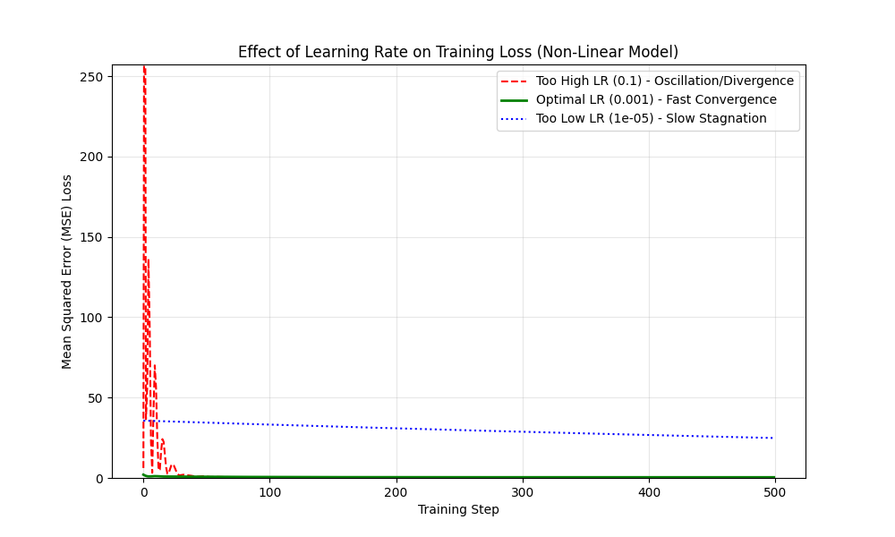

# Learning rate experiment

## Goal 

This experiment aims to visually and empirically demonstrate the critical effect of the learning rate ($\eta$) hyperparameter on the training convergence of a non-linear neural network model.

The central hypothesis tested is:
1. Too High $\eta$: Leads to oscillation of the loss, instability, or divergence
2. Too Low $\eta$: Leads to stagnation and extremely slow convergence
3. Optimal $\eta$: Leads to fast and stable convergence.

## Experiment details

### Model

A simple, two-layer feed-forward neural network was used to introduce the complexity necessary to observe the learning rate effects more clearly than with a linear model.

$$\mathbf{y} = \mathbf{W}_2 \cdot \text{ReLU}(\mathbf{W}_1 \cdot \mathbf{x} + \mathbf{b}_1) + \mathbf{b}_2$$

### Data 

The input data was generated using a non-linear function ($y = \sin(x/5) + x/10 + \text{noise}$) to create a complex loss surface, which better highlights the challenges of optimization.

## Results

Key Observations:

1. Too High LR (0.1): The loss explodes initially, then settles into high-amplitude oscillations. The step size is too large, causing the optimizer to continually overshoot the minimum.
2. Optimal LR (0.001): The loss drops sharply within the first 50 steps and rapidly converges to a minimal value. This represents the most efficient training path.
3. Too Low LR (0.00001): The loss curve is almost flat, showing only negligible decrease over 500 steps. The model requires an excessive number of steps to converge, illustrating the penalty of an overly conservative step size.
