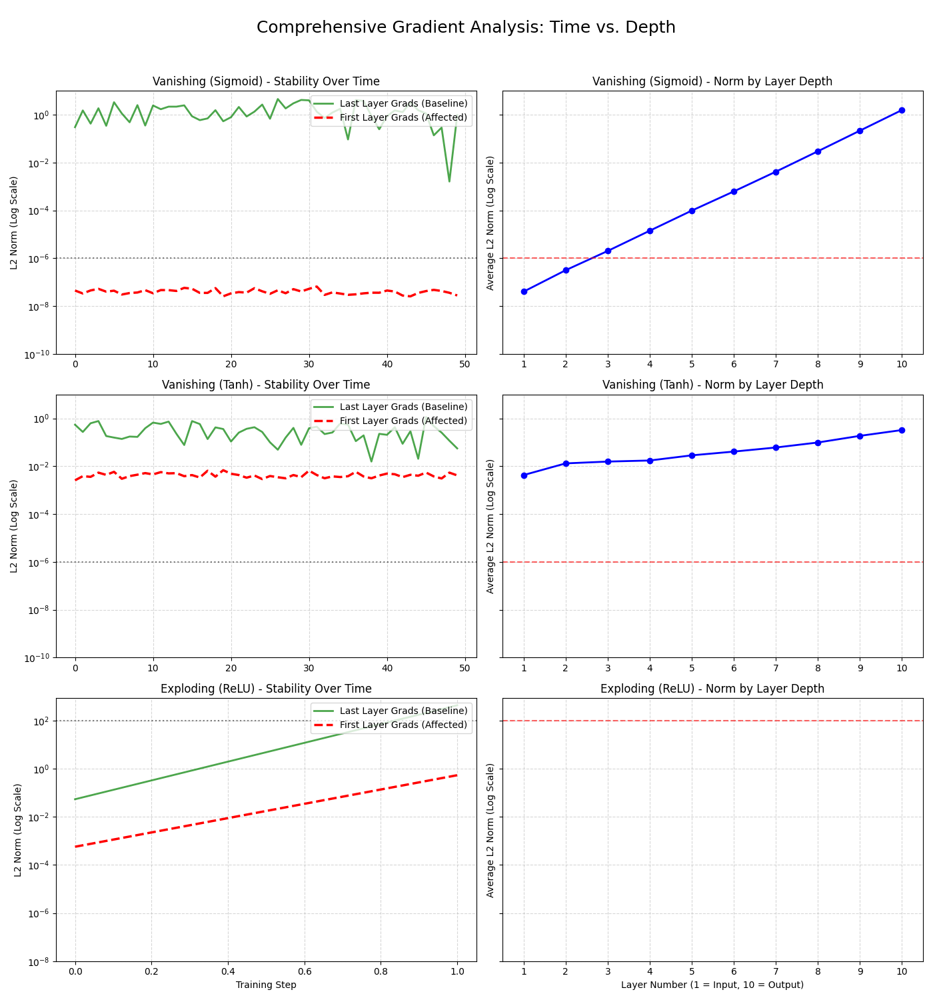

# Gradient Instability Analysis: Deep Neural Network (10 Layers)

## Goal 
This project investigates and visualizes gradient stability, Vanishing Gradients and Exploding Gradients in a 10 layered neural network implemented in PyTorch. The analysis tracks the $\text{L}_2$ Norm of the weight gradients across training steps (time) and across network depth (layer number) to diagnose the root causes of training divergence.

## Experiment details

The model is a 10-layer FCNN. Gradient norms were tracked for the weights of every single layer over 50 training steps.

The configuration of the experiments are:

1. Vanishing gradient: Sigmoid and tanh activation function with lr=0.01 to collapse the gradient towards 0.
2. Exploding gradient: Relu activation function with lr=100 to push the gradients to explode. 

### Results

### Vanishing Gradient (Sigmoid & Tanh)

The gradient vs layer number plots provide the most direct evidence of the vanishing phenomenon. The average gradient norm is highest at the output layer (Layer 10) and then monotonically decreases towards the input layer (Layer 1).

The gradient magnitude drops by approximately 6 to 8 orders of magnitude (e.g., from $10^{-1}$ down to $10^{-7}$ or $10^{-8}$) between the last and first layers. This confirms the error signal is effectively dead by the time it reaches the early layers.

### Exploding Gradient (ReLU & High LR)

The average gradient norm is uniformly high (capped at $\mathbf{10^8}$) across all layers, with no significant decay towards Layer. Since all layers maintain an average magnitude well above the $10^2$ stability threshold, the plot confirms that the runaway process universally amplified the signal. If the network had been stable, we would expect a relatively flat line near $10^{-1}$ to $10^{0}$.
